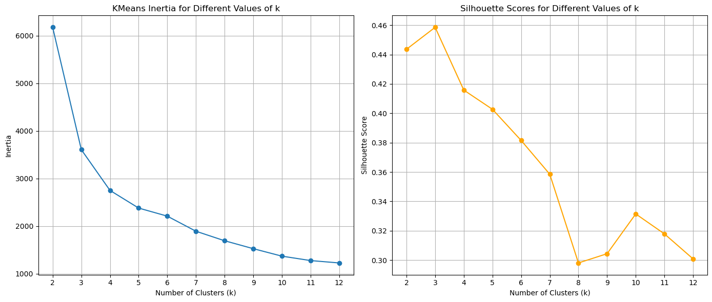
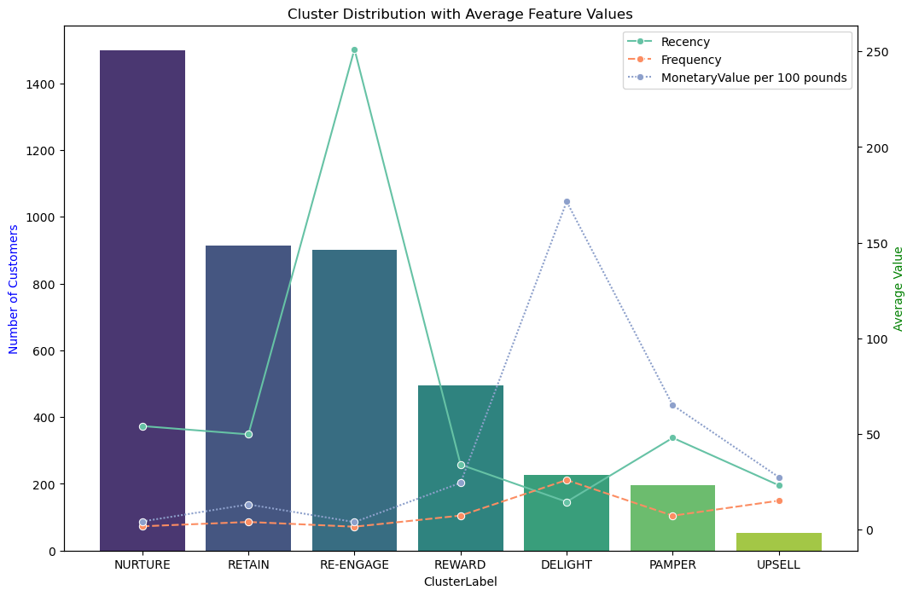
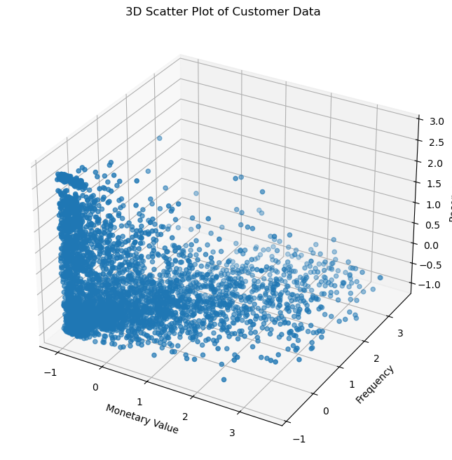
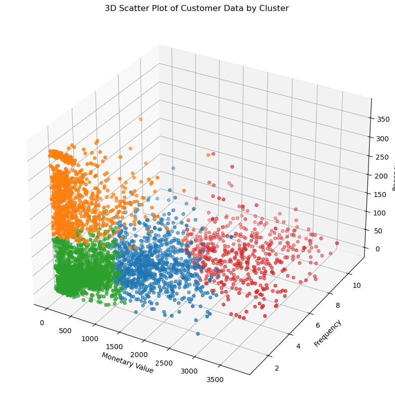
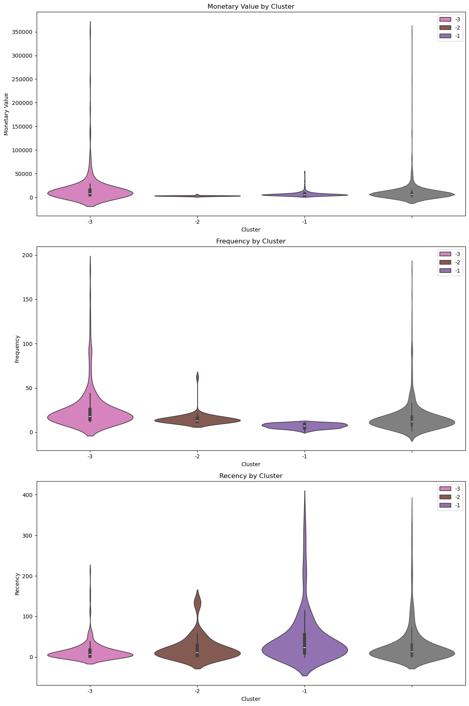

# 🛍️ Customer Segmentation with K-Means

This project applies customer segmentation techniques using **K-Means** based on the **Online Retail II** dataset, which contains transactions from a UK-based online retail company between 2009 and 2011. The goal is to identify different customer profiles based on **Recency, Frequency, and Monetary Value (RFM)** metrics.

---

## 📁 Dataset

- **Source:** [UCI Machine Learning Repository – Online Retail II](https://archive.ics.uci.edu/dataset/502/online+retail+ii)  
- **Period:** 01/12/2009 to 09/12/2011  
- **Main attributes:**  
  - `Invoice`, `StockCode`, `Description`, `Quantity`, `InvoiceDate`, `Price`, `CustomerID`, `Country`  
- **Business context:** Gift retail for both B2B and B2C customers.

---

## 🛠️ Tools and Techniques

- **Language:** Python (Pandas, Scikit-Learn, Matplotlib, Seaborn)
- **Clustering Model:** K-Means
- **Preprocessing:**  
  - Removal of missing values  
  - RFM feature calculation  
  - Data normalization and scaling

---

## 🔍 Choosing the Number of Clusters

The ideal number of clusters was determined using the **Elbow Method (Inertia)** and **Silhouette Score**:



---

## 📊 Feature Engineering

Segmentation is based on the RFM metrics:

- **Recency (R):** Days since the customer’s last purchase  
- **Frequency (F):** Total number of purchases  
- **Monetary Value (M):** Total amount spent

---

## 📈 Results and Visualizations

### Cluster Distribution and Feature Averages

This chart shows the number of customers per segment and the average Recency, Frequency, and Monetary Value for each cluster:



---

### 3D Visualization of Customer Data

Before clustering:



After clustering:



---

### RFM Distribution per Cluster

These violin plots show the distribution of each RFM metric across clusters:



---

## 🧠 Cluster Interpretation

| Cluster      | Profile       | Description                                                                 |
|--------------|---------------|-----------------------------------------------------------------------------|
| **NURTURE**  | Inactive      | High recency, low frequency and value. Customers who haven’t purchased recently. |
| **RETAIN**   | Regulars      | Active customers with moderate spending.                                   |
| **RE-ENGAGE**| Potential     | Recently purchased but infrequent.                                         |
| **REWARD**   | Loyal         | Frequent buyers with good monetary value.                                  |
| **DELIGHT**  | Premium       | High frequency and value, recently active.                                 |
| **PAMPER**   | VIPs          | High spend and frequency, but haven’t purchased recently.                  |
| **UPSELL**   | Opportunity   | Low frequency but high value — ideal for upsell campaigns.                 |

---

## 📌 Conclusion

This project demonstrates how clustering techniques can be applied to segment customers based on purchase behavior. The RFM analysis combined with K-Means provides actionable insights for marketing, retention, and sales strategies.

---

## 📎 Project Structure

```

📂 online-retail-data/
│
├── script.ipynb       # Notebook with full pipeline
├── img/
│   ├── Kmeans\_Inertia.png
│   ├── cluster\_distribution\_average.png
│   ├── customer\_Data.png
│   ├── Customer\_Data\_Cluster.png
│   └── Monetary\_Frequency\_Recency\_Cluster.png
└── README.md

```

---

## 📬 Contact

Developed by [Luis Ricardo Garcia](https://www.linkedin.com/in/lricardogarcia/) — feel free to connect!
```
